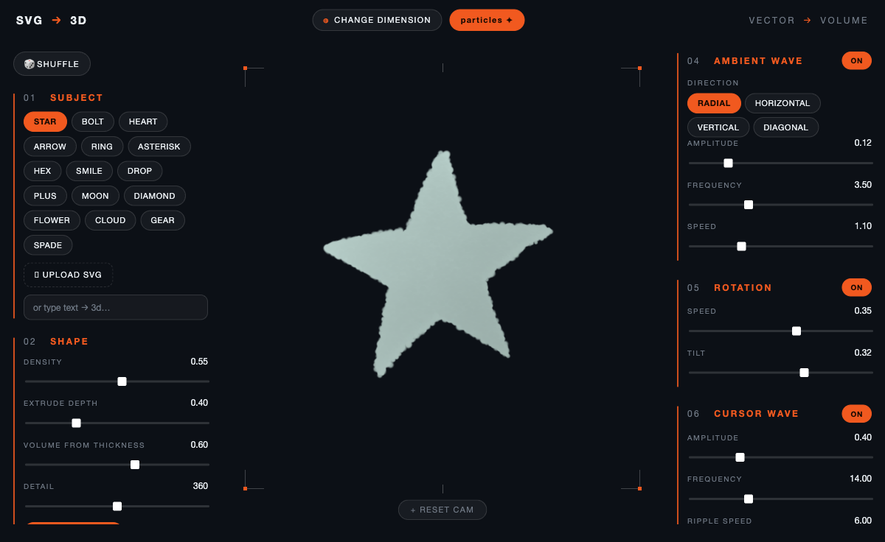

# SVG → 3D Particles · forge

Turn any SVG (or typed text, or a built-in shape) into a rotating, extruded
**3D particle volume** you can disturb with your cursor — then export it as
**WebM**, **GIF**, a **PNG frame sequence**, or as **embeddable code** you can
paste into your own website. Built with Three.js + Vite.



## Run

```bash
npm install
npm run dev      # http://localhost:5173
npm run build    # production build → dist/
```

## Panel guide

The UI is organized into numbered sections (left + right) over a full-bleed stage.

- **01 SUBJECT** — 16 built-in shapes (star, bolt, heart, gear, flower…),
  **UPLOAD SVG**, drag-and-drop *anywhere*, or `type text → 3d`.
- **02 SHAPE** — Density, Extrude depth, **Volume from thickness**, Detail,
  Use-SVG-colors, Particle color. *Volume from thickness* runs a distance
  transform over the shape so chunky regions bulge into a deeper, denser volume
  while thin strokes stay shallow (0 = uniform slab, 1 = fully volumetric).
- **03 LOOK** — Particle size, Opacity, Glow (additive), Depth fog, Background.
- **04 AMBIENT WAVE** — on/off, **Direction** (Radial / Horizontal / Vertical /
  Diagonal), Amplitude, Frequency, Speed.
- **05 ROTATION** — on/off, Speed, Tilt.
- **06 CURSOR WAVE** — on/off, Amplitude, Frequency, Ripple speed, Reach.
- **07 FILM & EXPORT** — FPS, Loop seconds, Rotations/loop, WebM seconds,
  export resolution (512 → 4K), transparent toggle, and the export buttons.

Top bar: **CHANGE DIMENSION** toggles perspective ↔ orthographic camera.
**SHUFFLE** randomizes the composition. Drag to orbit; **RESET CAM** recenters.

## Displacement is depth-only

The cursor/ambient waves only ever push particles along **Z (depth)** — never
along X/Y — so the silhouette of your original shape is always preserved (no
sideways smearing).

## Exports

| Format | How | Transparency |
|---|---|---|
| **WebM** | live `MediaRecorder`, VP9 @ 40 Mbps (captures cursor interaction) | browser-dependent (best in Chrome) |
| **GIF** | offline **seamless loop**, `gifenc` palette quantization | ✅ true alpha |
| **PNG frames** | zipped (`JSZip`), full alpha | ✅ true alpha |
| **GET CODE** | self-contained HTML/JS snippet — copy or download `.html` | ✅ |

GIF/PNG render offline at the chosen resolution and loop perfectly: the ambient
wave advances one full cycle and the turntable does N full rotations across the
frame range.

### Embed on your site

**GET CODE** produces a paste-anywhere snippet: a `<div id="svg-particles">`
plus a `<script type="module">` that loads Three.js from a CDN, re-samples your
baked SVG, and reproduces the live look (extrusion, ambient + cursor wave,
turntable). Honors the Transparent toggle. Verified to run standalone.

## Source map

| File | Role |
|---|---|
| [main.js](src/main.js) | scene, loop, motion modes, presets/material/scene wiring, export driver |
| [ui.js](src/ui.js) | builds the pill/slider panel, film strip, embed modal |
| [presets.js](src/presets.js) | built-in shapes + text→SVG |
| [svgSampler.js](src/svgSampler.js) | rasterize SVG → extruded particle positions |
| [particles.js](src/particles.js) | `THREE.Points` system + shader material |
| [shaders.js](src/shaders.js) | depth-only ambient + cursor wave shaders |
| [exporters.js](src/exporters.js) | WebM / GIF / PNG-sequence encoders |
| [embed.js](src/embed.js) | self-contained embed snippet + HTML generator |
